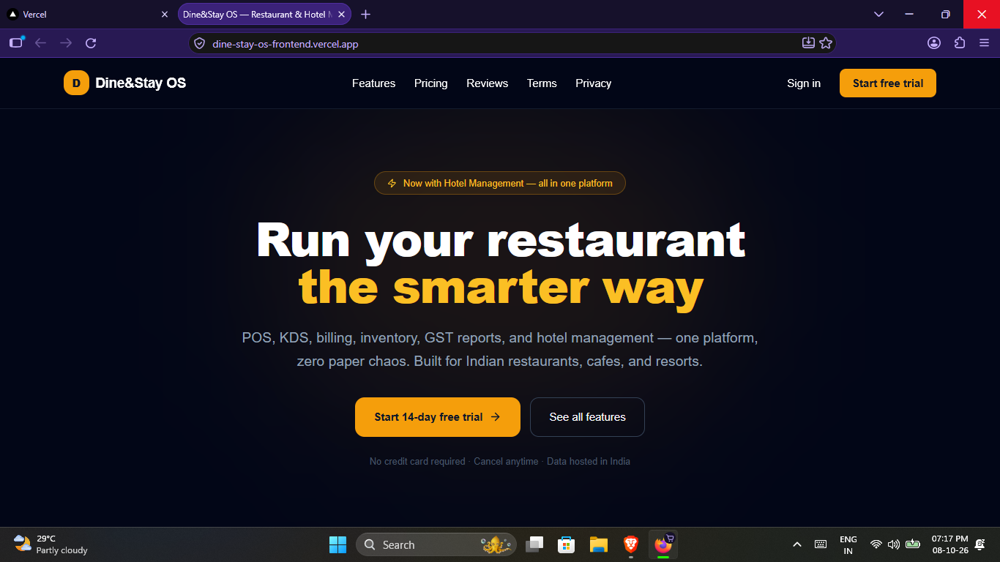
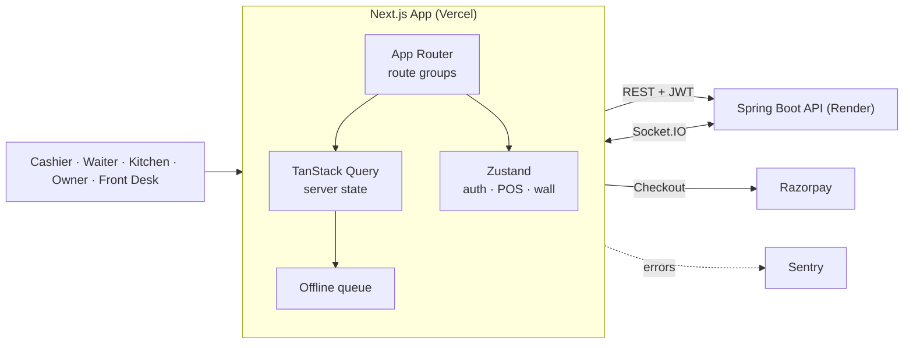

<div align="center">

# 🍽️🏨 Dine&Stay OS — Frontend

**The web client for a multi-tenant Restaurant POS + Hotel Management SaaS platform.**

Next.js · React · TypeScript · Tailwind CSS · TanStack Query · Zustand

[](https://dine-stay-os-frontend.vercel.app/)
[](https://github.com/anshuman-borah/Dine-Stay-OS-backend)
[](https://dinestay-backend-dubd.onrender.com/swagger-ui/index.html)


</div>

---

## 🎬 Demo

<!-- Replace with your screenshot: put the file at docs/screenshot.png -->
<p align="center">
  
</p>

<p align="center">
  <a href="https://youtu.be/m9O6sO0luzw"><b>▶️ Watch the full demo video</b></a>
</p>

> 🔗 **This repository is the frontend.** The Spring Boot API lives in the [backend repository](https://github.com/anshuman-borah/Dine-Stay-OS-backend), which has the full architecture, data model and API documentation.

> ⏳ The backend runs on Render's free tier and sleeps when idle, so the very first request can take ~30–60 seconds.

---

## ✨ Features

### 🍴 Restaurant
- **POS terminal** with order-type selection (dine-in / takeaway / delivery), table picker, modifiers, variations and add-ons
- **Billing modal** with split payments (cash / card / UPI / wallet), discounts and GST-accurate totals
- **Kitchen Display System (KDS)** that updates live over Socket.IO
- **Waiter and Cashier views** tailored to each role
- **Menu, table, inventory and shift management**, including cash denomination counting at shift open/close
- **Thermal receipt printing** with configurable printer settings

### 🏨 Hotel
- Room grid, reservations, guest profiles and check-in / check-out
- Housekeeping board with task status and priority
- Hotel billing, folio view and **Charge-to-Room** from the POS
- Dedicated hotel dashboard, reports and shift handling

### 📊 Insights & Administration
- Dashboard, reports, branch summary, branch-performance and executive views
- Multi-branch switcher
- Audit log viewer
- Employee and role management
- **Super-admin console** for tenants, plans, subscriptions, payments and platform activity

### 🛡️ Resilience
- **Offline-aware POS:** orders are queued locally and synced when connectivity returns
- Online/offline status indicator
- Subscription wall that gracefully gates features when a trial or plan expires
- Global error boundaries and loading skeletons
- **Sentry** error monitoring

---

## 🧰 Tech Stack

| Concern | Choice |
|---|---|
| Framework | Next.js (App Router) |
| Language | TypeScript |
| UI | React, Tailwind CSS |
| Server state | TanStack Query (React Query) |
| Client state | Zustand (`auth`, `pos`, `subscriptionWall` stores) |
| Real-time | Socket.IO client |
| Payments | Razorpay Checkout |
| Monitoring | Sentry |
| Monorepo tooling | Turborepo + shared types package |
| Deployment | Vercel |

---

## 🏗️ Architecture



Routes are organised with **Next.js route groups**, so each area gets its own layout and access rules:

| Group | Purpose |
|---|---|
| `(auth)` | Login, register, forgot / reset password |
| `(dashboard)` | Tenant-facing app: POS, KDS, menu, tables, inventory, shifts, reports, hotel, employees, settings |
| `(admin)` | Platform super-admin console |
| `(legal)` | Privacy policy and terms |

---

## 📁 Project Structure

```
src/
├── app/
│   ├── (auth)/          # login · register · forgot/reset password
│   ├── (dashboard)/     # pos · cashier · waiter · kds · menu · tables · inventory
│   │   │                # shifts · reports · billing · employees · audit · settings
│   │   └── hotel/       # dashboard · rooms · reservations · housekeeping · billing · shifts · report
│   ├── (admin)/admin/   # tenants · plans · subscriptions · payments · activity
│   └── (legal)/         # privacy · terms
├── components/          # BranchSwitcher · billing · pos · ui (ErrorBoundary, Skeleton, SubscriptionWall)
├── hooks/               # useSocket · useOnlineStatus · usePrinterSettings · useSubscriptionWall
├── lib/                 # api client · gst calculations · offline queue · printer · utils
└── store/               # auth.store · pos.store · subscriptionWall.store
packages/shared/         # shared types & constants (GST, plans, billing, orders, users)
```

---

## 🚀 Getting Started

### Prerequisites
- Node.js 18+
- npm
- A running backend (use the live one, or run the [backend](https://github.com/anshuman-borah/Dine-Stay-OS-backend) locally)

### 1. Clone & install

```bash
git clone https://github.com/anshuman-borah/Dine-Stay-OS-frontend.git
cd Dine-Stay-OS-frontend
npm install
```

### 2. Configure environment

Copy `.env.example` to `.env` and adjust:

```env
APP_URL=http://localhost:3000

# Point at the live API, or http://localhost:4000 for a local backend
API_URL=https://dinestay-backend-dubd.onrender.com
NEXT_PUBLIC_API_URL=https://dinestay-backend-dubd.onrender.com
NEXT_PUBLIC_API_HOST=https://dinestay-backend-dubd.onrender.com

# Feature flags
ENABLE_MULTI_BRANCH=true
ENABLE_HOTEL_MODULE=true

# Optional integrations
NEXT_PUBLIC_SENTRY_DSN=
RAZORPAY_KEY_ID=
```

### 3. Run

```bash
npm run dev
```

Open **http://localhost:3000**.

### Production build

```bash
npm run build
npm start
```

---

## ☁️ Deployment

The frontend is deployed on **Vercel** and talks to the Spring Boot backend on **Render** over HTTPS with JWT authentication and CORS configured for the Vercel origin.

Set the same environment variables in your Vercel project settings.

---

## 🔗 Related

| | |
|---|---|
| 🛠️ **Backend repository** | [Dine-Stay-OS-backend](https://github.com/anshuman-borah/Dine-Stay-OS-backend) |
| 📖 **Live API docs** | [Swagger UI](https://dinestay-backend-dubd.onrender.com/swagger-ui/index.html) |
| 📊 **Live metrics** | [Prometheus](https://dinestay-backend-dubd.onrender.com/actuator/prometheus) |
| 🏥 **Health check** | [/actuator/health](https://dinestay-backend-dubd.onrender.com/actuator/health) |

---

## 👤 Author

**Anshuman Borah** — [@anshuman-borah](https://github.com/anshuman-borah)

---

<div align="center">
⭐ If you found this project interesting, consider giving it a star!
</div>
